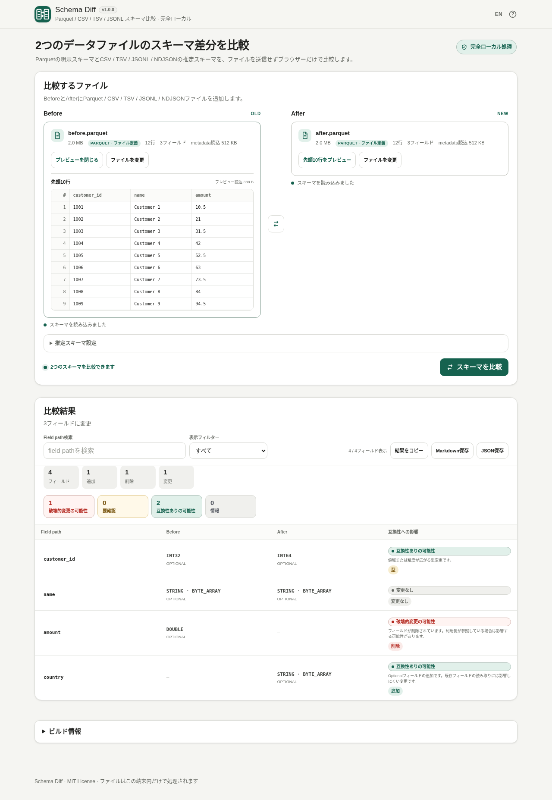

# Schema Diff

バージョン: v1.0.2

ヘッダーの言語切り替えは EN / JA で統一し、切り替え先とヘルプの説明は表示言語に合わせます。バージョンは vMAJOR.MINOR.PATCH 形式で、バッジは「完全ローカル処理」/「Fully local processing」のままです。

[](https://github.com/ttomohisa/htmlapps-schema-diff/actions/workflows/deploy-pages.yml)
[](LICENSE)
[](https://ttomohisa.github.io/htmlapps-schema-diff/)

[English README](README.md)

Parquet / CSV / TSV / JSONL / NDJSONの2ファイルを、選択したファイルを外部サーバーへ送信せずブラウザー内だけで比較する単一HTMLのSchema Diffツールです。

## 🚀 GitHub Pages

### [GitHub PagesでSchema Diffを開く](https://ttomohisa.github.io/htmlapps-schema-diff/)

このリポジトリにはGitHub Pagesへの自動公開ワークフローが含まれています。上のリンクは、リポジトリを公開して **GitHub Actions** をPagesのSourceに設定した後に利用できます。

GitHub Pages版では最初のHTML配信だけが発生し、その後に選択したファイルの読み込み・推定・比較・プレビュー・レポート生成はブラウザー内で処理します。選択したファイルをアプリからサーバーへアップロードしません。

[](https://ttomohisa.github.io/htmlapps-schema-diff/)

## 主な機能

- **Before / Afterのスキーマ比較** — 追加・削除・名前変更・型・NULL可否・Decimal・構造・Field IDの変更を確認できます。
- **Parquet / CSV / TSV / JSONL / NDJSON** — 同じ形式同士だけでなく、保守的な共通型を使った形式横断比較にも対応します。
- **DeclaredとInferredを区別** — Parquetはファイルに定義されたスキーマ、テキスト形式は観測データからの推定スキーマとして明確に分けて表示します。
- **Nested構造をfield pathで確認** — `customer.email`、`tags[]`、`items[].sku`、MAPのkey/valueなどを読みやすいpathで比較します。
- **Field IDによるrename認識** — 両側で一意なParquet Field IDだけをrename対応付けに使い、名前の類似だけでは推測しません。
- **互換性への影響の目安** — 「破壊的変更の可能性 / 要確認 / 互換性ありの可能性 / 情報」と理由を表示し、普遍的なsafe/broken判定は行いません。
- **先頭10行プレビュー** — Before / Afterそれぞれを必要なときだけ遅延読み込み。プレビューを開かなければ行データを読みません。
- **推定設定** — 20,000 / 100,000 / 全件から選択でき、CSV / TSVではヘッダーの自動判定・手動指定も可能です。
- **検索・フィルター・レポート** — field path検索、表示フィルター、Markdownコピー、Markdown / JSON保存に対応します。
- **PC / スマートフォン対応** — プレビュー内スクロール、タップしやすい操作、日本語 / 英語UI、ページ全体の横スクロールを起こさないレイアウトを重視しています。
- **完全ローカル処理の単一HTML** — 登録・インストール不要。CSPで実行時通信を禁止し、ローカルHTMLとして直接開けます。

## すぐに使う

### Webで使う

リポジトリ公開・Pages有効化後は、[GitHub Pages版](https://ttomohisa.github.io/htmlapps-schema-diff/)を開くだけで利用できます。アカウント登録やインストールは不要です。

### ダウンロードして使う

1. このリポジトリをダウンロードまたはクローンします。
2. `dist/index.html` を最新ブラウザーで開きます。
3. **Before** と **After** にファイルを追加します。
4. **スキーマを比較** を押します。

`dist/index.html` は自己完結した単一HTMLで、ローカルWebサーバーは不要です。`dist/index.self-extract.html` は `DecompressionStream` 対応ブラウザー向けのgzip自己展開版です。

### 自分でビルドする（advance）

1. Windows 10/11でリポジトリをダウンロードまたはクローンします。
2. 必要に応じてPowerShell 7を用意します。
3. `build-standalone.bat` を実行します。
4. `dist/` に生成されたファイルを利用します。

Schema Diffの `dependencies.json` には現在パッケージ依存を登録していません。Parquetのmetadata / preview処理には、固定したhyparquetの一部を必要範囲だけ適用しており、詳細は [THIRD_PARTY_NOTICES.md](THIRD_PARTY_NOTICES.md) に記載しています。

## 使い方

1. 比較元を **Before**、比較先を **After** に追加します。ファイル選択とDrag & Dropに対応します。
2. CSV / TSV / JSONL / NDJSONでは必要に応じて推定行数を変更します。CSV / TSVではヘッダー設定も調整できます。
3. 必要なら各ファイルの**先頭10行をプレビュー**を開き、比較対象データを確認します。プレビューとスキーマ比較は独立しています。
4. **スキーマを比較** を押します。
5. サマリー、field path、元の型 / 正規化型、互換性への影響の目安を確認します。
6. field path検索や表示フィルターで必要な差分へ絞り込みます。
7. 必要に応じて**結果をコピー**、Markdown保存、JSON保存を行います。

### 表示フィルター

比較結果は次の条件で絞り込めます。

- すべて
- 変更のみ
- 追加
- 削除
- 名前変更
- 型変更
- 破壊的変更の可能性
- 要確認

「名前変更」は両側で一意なField IDが一致するParquetフィールドに絞り込み、型なども同時に変わったフィールドを含みます。変更前・変更後のパスで検索できます。似た名前や重複したIDだけでは名前変更と判定しません。

検索とフィルターは**画面表示だけ**に適用されます。結果コピー、Markdown保存、JSON保存には常に比較結果全体を含めます。

CSV / TSVの重複・空欄ヘッダーには一意の名前を割り当てます。明示された列名を先に確保するため、`value,value,value_2`は`value,value_3,value_2`となり、すべてのプレビュー値が保持されます。自動判定でヘッダーにならない場合は手動設定を利用してください。

### Before / After入れ替え

スキーマやプレビューの読み込み中は入れ替えできません。読み込み中のプレビューを閉じても完了を待ち、再び開いた場合は同じ読み込みを利用します。

比較済みの状態でBefore / Afterを入れ替えると、逆方向の比較を自動で再実行します。

## 形式ごとのSchema処理

### Parquet

Parquetではファイルmetadataに定義されたDeclared Schemaを使用します。Nested `STRUCT` / `LIST` / `MAP`、Physical / Logical Type、`REQUIRED` / `OPTIONAL` / `REPEATED`、Decimal precision / scale、Field IDを比較します。

Field matchingは保守的です。

1. 両側でField IDが一意な場合だけ、同じField IDを最優先で対応付けます。
2. Field IDで対応できない場合は正規化したfield pathを使います。
3. 名前が似ているだけではrenameと判断しません。
4. 重複Field IDはrename推定に使いません。

最初のスキーマ読込はmetadata-onlyを維持し、任意の先頭10行プレビューを開いた場合だけ必要なrow group / pageを読みます。

### CSV / TSV

CSV / TSVには明示スキーマがないため、観測データから推定します。推定型は `NULL`、`BOOLEAN`、`INT32`、`INT64`、`FLOAT64`、`DATE`、`TIMESTAMP`、`STRING` です。

数値は `INT32 → INT64 → FLOAT64` の順に広げます。NULLを観測しなかっただけでRequired制約とは判断しません。内蔵のincremental parserでquoted field、quoted newline、escaped quote、CRLF / LF、UTF-8 BOMなどの一般的なRFC 4180ケースを処理します。

### JSONL / NDJSON

JSONL / NDJSONは空行を除き、1行1JSON objectとしてincrementalに読み込みます。Nested object / arrayは読みやすいfield pathへ展開し、明示的な`null`とmissing fieldは別々に記録します。

JSONの型はそのまま尊重します。例えば文字列`"123"`を整数へ勝手に変換しません。

### Cross-format比較

Parquetの論理INTEGER型は、宣言されたビット幅（8 / 16 / 32 / 64）と符号の有無を保持します。符号付きINT32 / INT64は対応する推定型と一致し、符号なしや幅の狭い型は区別します。

各形式の元の型情報を残したまま、意味が近いものだけを保守的なNormalized Typeで比較します。例えばParquetのSTRING semanticsと推定`STRING`は、形式差だけで型変更にしません。

一方で、意味が同じと確認できない情報は潰しません。Decimalと推定`FLOAT64`、JSON objectとParquet `MAP`を自動的に同一視せず、日付に見えるJSON文字列も`STRING`のまま扱います。

推定スキーマが片側でも関係する変更は、観測サンプルが明示的なデータ契約ではないため原則**要確認**とします。

## 先頭10行プレビュー

読み込み済みのBefore / Afterには、それぞれ遅延プレビューがあります。

- CSV / TSVはincrementalな区切りテキストreaderを再利用します。
- JSONL / NDJSONはJSON Lines readerを再利用します。
- ParquetはSchema読込をmetadata-onlyのまま維持し、プレビューを開いたときだけrow group / pageを読みます。
- 同じファイルを選択している間はプレビュー結果をキャッシュし、ファイルを変更すると破棄します。
- 列が多い場合もプレビュー領域内だけを横スクロールし、ページ全体を横へ広げません。

Parquetのコンパクトなpreview pathはUncompressed / Snappy / Gzip / LZ4 / LZ4_RAWを直接扱います。Brotli / Zstandardはブラウザーに互換性のあるnative decompressorがある場合だけ試し、未対応でもSchema比較は継続できます。LZOの行プレビューには対応していません。

## Compatibilityの目安

Declared Parquetでは、普遍的な互換性を断定せず一般的な目安を表示します。

- **破壊的変更の可能性** — フィールド削除、Required追加、Optional→Required、構造変更、既知の数値型縮小、Decimal precision縮小など
- **要確認** — Field IDを維持したrename、Field ID変更、Decimal scale変更、Timestamp意味変更、既知ルールに当てはまらない型変更など
- **互換性ありの可能性** — Optional追加、Required→Optional、INT32→INT64などの既知の型拡張
- **情報** — 影響が小さい情報用

実際の互換性は、利用するreader / writer / table format / アプリ側の契約によって変わります。

## GitHub Pagesで公開する

このリポジトリには、単一HTMLをビルド・検証して `dist/` をGitHub Pagesへ公開するワークフローが含まれています。

1. `ttomohisa/htmlapps-schema-diff` としてリポジトリを公開します。
2. **Settings → Pages → Build and deployment → Source** で **GitHub Actions** を選択します。
3. `main` にpushするか、Actionsから **Deploy standalone app to GitHub Pages** を手動実行します。
4. 成功後、`https://ttomohisa.github.io/htmlapps-schema-diff/` で利用できます。

公開時には単一HTMLを再生成し、リポジトリ検証を通した後にPagesへアップロードします。

## 開発とビルド

```text
.
├─ src/index.template.html       # アプリ本体
├─ app.config.json               # アプリ情報・ビルド設定
├─ dependencies.json             # 埋め込み依存設定（現在は空）
├─ dependencies.lock.json        # 依存lock
├─ scripts/                      # 検証・fixture・ビルド補助
├─ test-data/                    # 回帰テストデータ
├─ assets/                       # favicon / screenshot
├─ build-standalone.bat          # Windows用ビルド入口
├─ build-standalone.ps1          # 単一HTMLビルダー
└─ dist/
   ├─ index.html                 # 読みやすい単一HTML
   └─ index.self-extract.html    # gzip自己展開版
```

回帰fixtureは以下で再生成できます。

```powershell
python .\scripts\generate-test-parquet.py
python .\scripts\generate-test-delimited.py
python .\scripts\generate-test-jsonl.py
```

リリース用HTMLは以下で生成します。

```powershell
.\build-standalone.bat
```

リポジトリの検証スクリプトでは、テンプレート契約、CSP / 実行時通信防止、単一HTML、self-extract整合性、placeholder、build-size reportなどを確認します。

## プライバシーと通信防止

Schema Diffは**完全ローカル処理**を前提にしています。

- 選択したファイルはBrowser File APIで読み、アプリからアップロードしません。
- 配布HTMLのContent Security Policyには `connect-src 'none'` を含めます。
- 実行時CDN import、analytics、telemetry、外部font、remote data APIを必要としません。
- ParquetのSchema比較は通常、ファイル全体ではなく末尾付近のmetadataを読みます。
- 行データは先頭10行プレビューを明示的に開いた場合だけ読みます。
- CSV / TSV / JSONL / NDJSONは設定したサンプル数とプレビュー要求に応じてincrementalに読みます。

GitHub Pages版ではアプリを開くための最初のHTML通信は発生します。完全にネットワークを切って使う場合は `dist/index.html` をローカルで開いてください。

## 制限事項

- Compatibilityラベルは一般的な目安であり、特定の利用先での動作を保証しません。
- CSV / TSV / JSONL / NDJSONのSchemaは明示制約ではなく観測データからの推定です。
- 推定サンプル範囲外にだけ存在する値は推定Schemaへ反映されません。
- 類似名称だけを根拠にrename推定しません。
- 重複Field IDはrename対応付けに使いません。
- 列順だけのSchema変更は個別分類しません。
- CSV / TSV / JSONL / NDJSONはUTF-8を主対象とします。
- 一部のParquet圧縮形式は任意の行プレビューで未対応でも、Schema比較は行える場合があります。
- 壊れたファイル、暗号化ファイル、その他未対応のファイルは読み込めない場合があります。
- 大きな推定サンプルや列数の多いプレビューでは、ファイルやブラウザーによって端末メモリを多く使用します。

## 第三者コード

| プロジェクト | バージョン / pin | ライセンス | 用途 |
| --- | --- | --- | --- |
| hyparquet | 1.30.0 / `f01340277ec2d4ad2e96a7629c30d04fb54a9e15` | MIT | Parquet metadata/schema解析と必要時だけ使うコンパクトなpreview pathを一部適用 |

実行時にhyparquet packageやCDNを読み込みません。詳細なnoticeとライセンス本文は [THIRD_PARTY_NOTICES.md](THIRD_PARTY_NOTICES.md) を確認してください。

## コントリビューション

リポジトリ公開後、バグ報告や機能提案はGitHub Issuesからお願いします。開発への参加方法は [CONTRIBUTING.md](CONTRIBUTING.md) を確認してください。

## ライセンス

Copyright © 2026 ttomohisa

このプロジェクトは [MIT License](LICENSE) で公開されています。

### 開発用の回帰テスト

依存パッケージ不要の実行テストにはNode.js 22以降を使用します。ソース変更後はビルドして`Copy-Item dist/index.html schema-diff.html`で配布用HTMLを更新し、`scripts/check-repository.ps1`を実行してください。ビルド日時以外の配布用HTMLのずれを検出し、ソース・通常版・配布用HTML・自己展開版の復元内容を検証します。
