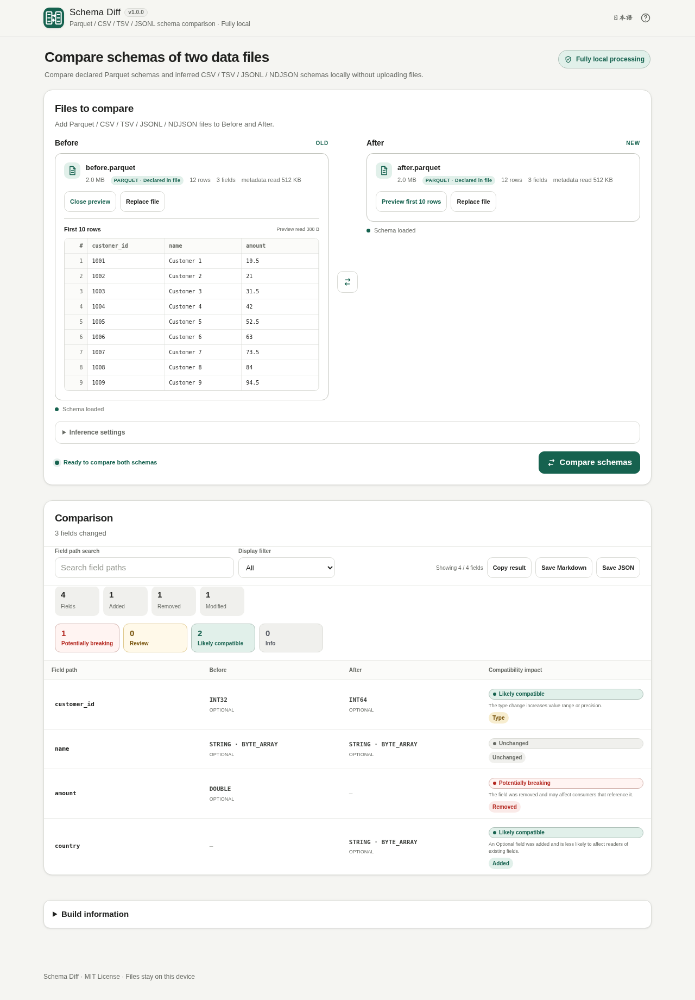

# Schema Diff

Version: v1.0.2

The header uses EN / JA language targets with localized accessible names and Help titles; the version follows vMAJOR.MINOR.PATCH. The local-processing badge remains 完全ローカル処理 / Fully local processing.

[](https://github.com/ttomohisa/htmlapps-schema-diff/actions/workflows/deploy-pages.yml)
[](LICENSE)
[](https://ttomohisa.github.io/htmlapps-schema-diff/)

[日本語版 README](README.ja.md)

A fully local, single-HTML app for comparing the schemas of two Parquet, CSV, TSV, JSONL, or NDJSON files without uploading the selected files to a server.

## 🚀 GitHub Pages

### [Open Schema Diff on GitHub Pages](https://ttomohisa.github.io/htmlapps-schema-diff/)

The repository includes a GitHub Pages deployment workflow. The link above becomes available after the repository is published and Pages is enabled with **GitHub Actions** as the source.

GitHub Pages delivers the initial HTML. After it loads, selected files are read and compared locally in the browser; the app does not upload those files.

[](https://ttomohisa.github.io/htmlapps-schema-diff/)

## Features

- **Compare Before and After schemas** — Inspect added, removed, renamed, type, nullability, Decimal, structure, and Field-ID changes.
- **Parquet, CSV, TSV, JSONL, and NDJSON** — Compare files within one format or across formats through conservative normalized types.
- **Declared vs inferred schemas stay distinct** — Parquet uses its declared metadata schema; text formats are explicitly shown as inferred from observed data.
- **Nested Parquet and JSON paths** — Work with readable paths such as `customer.email`, `tags[]`, `items[].sku`, and map key/value paths.
- **Field-ID rename recognition** — A unique Field ID on both Parquet sides can match a renamed field without fuzzy-name guessing.
- **Compatibility guidance** — Changes are labeled Potentially breaking, Review, Likely compatible, or Info with an explanation rather than a universal safe/broken claim.
- **First 10 rows preview** — Open a lazy, independent preview for Before or After. Row data is not read until the preview is requested.
- **Inference controls** — Use 20,000, 100,000, or all rows/objects; CSV / TSV also support header auto-detection or manual override.
- **Search, filter, and export** — Search field paths, filter the on-screen comparison, copy Markdown, or save Markdown / JSON reports.
- **Desktop and mobile UI** — Responsive layouts, contained preview scrolling, touch-friendly actions, Japanese / English UI, and no intended page-level horizontal scrolling.
- **Fully local single-HTML operation** — No account or installation is required, runtime network connections are blocked by CSP, and the app can be opened directly as a local HTML file.

## Quick start

### Use the GitHub Pages build

After the repository has been published and Pages enabled, open the [GitHub Pages app](https://ttomohisa.github.io/htmlapps-schema-diff/). No account or installation is required.

### Use the downloaded single HTML

1. Download or clone this repository.
2. Open `dist/index.html` in a current browser.
3. Add a **Before** file and an **After** file.
4. Select **Compare schemas**.

`dist/index.html` is self-contained and does not require a local web server. `dist/index.self-extract.html` is a smaller gzip self-extracting variant for browsers that support `DecompressionStream`.

### Build it yourself (advanced)

1. Download or clone this repository on Windows 10/11.
2. Install PowerShell 7 if it is not already available.
3. Run `build-standalone.bat`.
4. Use the generated files in `dist/`.

Schema Diff currently has no package entries in `dependencies.json`; the Parquet metadata/preview code used by the app is an adapted, pinned subset documented in [THIRD_PARTY_NOTICES.md](THIRD_PARTY_NOTICES.md).

## Usage

1. Add the original file to **Before** and the new file to **After**. File picker and drag & drop are supported.
2. For CSV / TSV / JSONL / NDJSON, adjust the inference row limit if needed. CSV / TSV also provide header controls.
3. Optionally open **Preview first 10 rows** on either file to verify the data being compared. The preview is independent from schema comparison.
4. Select **Compare schemas**.
5. Review the summary, field-path changes, original/normalized types, and compatibility guidance.
6. Use field-path search or the display filter to investigate the result.
7. Use **Copy result**, **Save Markdown**, or **Save JSON** when you need to keep or process the full comparison.

### Display filters

The result view can show:

- All fields
- Changed fields only
- Added fields
- Removed fields
- Renamed fields
- Type changes
- Potentially breaking changes
- Review items

The Renamed filter shows fields matched by a unique Field ID on both Parquet sides, including renames with other changes. Search can match either the old or new path. Similar names or ambiguous IDs do not create rename matches.

Search and filters affect only the screen. Copy, Markdown export, and JSON export always use the complete comparison result.

Duplicate or blank CSV / TSV headers receive deterministic unique names. Explicit column names are reserved first, so `value,value,value_2` becomes `value,value_3,value_2` and every preview cell is retained. Use the manual header setting when automatic detection does not identify a header.

### Before / After swap

Swap becomes available after any schema or preview read finishes, including when you close a loading preview. Reopening that preview reuses its pending read.

If a comparison is already displayed, swapping Before and After immediately recomputes the comparison in the reverse direction.

## Schema behavior by format

### Parquet

Parquet uses the schema declared in file metadata. The app compares nested `STRUCT`, `LIST`, and `MAP` paths, Physical / Logical Types, `REQUIRED` / `OPTIONAL` / `REPEATED`, Decimal precision / scale, and Field IDs.

Field matching is conservative:

1. A Field ID is used first only when it is unique on both sides.
2. Otherwise the normalized field path is used.
3. Similar names alone are not treated as a rename.
4. Duplicate Field IDs are excluded from rename inference.

Initial schema extraction remains metadata-only. Opening the optional first-10-row preview reads the required row-group/page data on demand.

### CSV / TSV

CSV / TSV schemas are inferred from observed data. Supported inferred types are `NULL`, `BOOLEAN`, `INT32`, `INT64`, `FLOAT64`, `DATE`, `TIMESTAMP`, and `STRING`.

Numeric inference widens through `INT32 → INT64 → FLOAT64`. Not observing a NULL does **not** create a Required constraint. The built-in incremental parser handles common RFC 4180 cases including quoted fields, quoted newlines, escaped quotes, CRLF / LF, and UTF-8 BOM.

### JSONL / NDJSON

JSONL / NDJSON is read incrementally as one JSON object per non-empty line. Nested objects and arrays are expanded into readable field paths while explicit `null` and missing fields remain separate observations.

JSON values keep their intrinsic JSON type. For example, the string `"123"` remains `STRING` rather than being converted to an integer.

### Cross-format comparison

Schema Diff preserves each format's original type details and compares a conservative normalized type where appropriate. Equivalent representations such as Parquet STRING semantics and inferred `STRING` can match without creating a format-only type change.

Parquet logical INTEGER types preserve their declared width (8 / 16 / 32 / 64 bits) and signedness. Signed INT32 / INT64 can match the corresponding inferred types; unsigned or narrower types remain distinct.

Normalization intentionally does not erase semantics that are not known to be equivalent. For example, Decimal is not treated as inferred `FLOAT64`, JSON objects are not silently treated as Parquet `MAP`, and date-looking JSON strings remain `STRING`.

Whenever an inferred schema is involved in a changed row, the compatibility impact is normally **Review** because the observed sample is not an explicit data contract.

## First 10 rows preview

Each loaded file has its own lazy preview.

- CSV / TSV reuse the incremental delimited-text reader.
- JSONL / NDJSON reuse the incremental JSON-lines reader.
- Parquet keeps schema extraction metadata-only and reads row-group/page data only when its preview is opened.
- Preview data is cached while the same file remains selected and cleared when the file is replaced.
- Wide preview tables scroll inside the preview panel instead of widening the page.

The compact Parquet preview path handles Uncompressed, Snappy, Gzip, LZ4, and LZ4_RAW directly. Brotli / Zstandard are attempted only when the browser provides a compatible native decompressor; unsupported preview codecs do not prevent schema comparison. LZO row preview is not supported.

## Compatibility guidance

For declared Parquet schemas, Schema Diff shows general guidance rather than claiming universal compatibility:

- **Potentially breaking** — examples include field removal, Required additions, Optional → Required, structural changes, known numeric narrowing, and Decimal precision reduction.
- **Review** — examples include Field-ID rename, Field-ID changes, Decimal scale changes, timestamp-semantic changes, and type changes without a known widening/narrowing rule.
- **Likely compatible** — examples include Optional additions, Required → Optional, and known widening such as INT32 → INT64.
- **Info** — low-impact informational changes.

Actual compatibility still depends on the downstream reader, writer, table format, and application contract.

## Publish with GitHub Pages

The repository includes a workflow that builds the standalone artifacts, verifies them, and deploys `dist/` to GitHub Pages.

1. Publish the repository as `ttomohisa/htmlapps-schema-diff`.
2. Open **Settings → Pages → Build and deployment → Source** and select **GitHub Actions**.
3. Push to `main`, or manually run **Deploy standalone app to GitHub Pages** from the Actions tab.
4. After a successful deployment, the app is available at `https://ttomohisa.github.io/htmlapps-schema-diff/`.

Each deployment build regenerates the standalone HTML and runs repository verification before upload.

## Development and build layout

```text
.
├─ src/index.template.html       # Application source/template
├─ app.config.json               # App metadata and build settings
├─ dependencies.json             # Embedded package configuration (currently empty)
├─ dependencies.lock.json        # Dependency lock file
├─ scripts/                      # Verification, fixture, and build helpers
├─ test-data/                    # Regression fixtures
├─ assets/                       # Favicon and screenshots
├─ build-standalone.bat          # Windows build entry point
├─ build-standalone.ps1          # Standalone HTML builder
└─ dist/
   ├─ index.html                 # Readable single-HTML artifact
   └─ index.self-extract.html    # Gzip self-extracting single-HTML artifact
```

Generate regression fixtures with:

```powershell
python .\scripts\generate-test-parquet.py
python .\scripts\generate-test-delimited.py
python .\scripts\generate-test-jsonl.py
```

Build the release artifacts with:

```powershell
.\build-standalone.bat
```

Use Node.js 22 or newer for the dependency-free runtime regressions. After changing source, build and refresh the tracked download alias with `Copy-Item dist/index.html schema-diff.html`, then run `scripts/check-repository.ps1`. The check rejects a stale alias (ignoring only its build timestamp) and tests the source, readable HTML, alias, and restored self-extract payload.

The repository verification scripts check the template contract, CSP/runtime-network protection, generated standalone HTML, self-extract integrity, placeholders, and build-size reports.

## Privacy and runtime network protection

Schema Diff is designed for **fully local processing**.

- Selected files are read with browser file APIs and are not uploaded by the app.
- The release HTML uses a Content Security Policy with `connect-src 'none'`.
- Runtime CDN imports, analytics, telemetry, external fonts, and remote data APIs are not required.
- Parquet schema comparison normally reads metadata near the end of the file instead of reading the entire file.
- Row data is read only when a first-10-row preview is explicitly opened.
- CSV / TSV / JSONL / NDJSON are read incrementally according to the configured sample and preview request.

The GitHub Pages version still needs the initial HTML request to load the app. For use with the network completely disconnected, open `dist/index.html` locally.

## Limitations

- Compatibility labels are guidance and cannot guarantee behavior in a particular downstream system.
- CSV / TSV / JSONL / NDJSON schemas are inferred from observed data rather than explicit constraints.
- Values that exist only outside the selected inference sample are not reflected in the inferred schema.
- Similar field names alone are not used to infer renames.
- Duplicate Field IDs are not used for rename matching.
- Order-only schema changes are not classified separately.
- CSV / TSV / JSONL / NDJSON primarily target UTF-8 input.
- Some Parquet compression codecs may be unsupported by the optional row preview even though schema comparison still works.
- Damaged, encrypted, or otherwise unsupported files may not be readable.
- Large inference samples and wide previews can use substantial device memory depending on the file and browser.

## Third-party code

| Project | Version / pin | License | Purpose |
| --- | --- | --- | --- |
| hyparquet | 1.30.0 / `f01340277ec2d4ad2e96a7629c30d04fb54a9e15` | MIT | Adapted Parquet metadata/schema parsing and compact on-demand preview path |

No hyparquet package or CDN resource is loaded at runtime. See [THIRD_PARTY_NOTICES.md](THIRD_PARTY_NOTICES.md) for the included notice and license text.

## Contributing

Bug reports and feature proposals are welcome through GitHub Issues after the repository is published. See [CONTRIBUTING.md](CONTRIBUTING.md) for development guidance.

## License

Copyright © 2026 ttomohisa

Licensed under the [MIT License](LICENSE).
